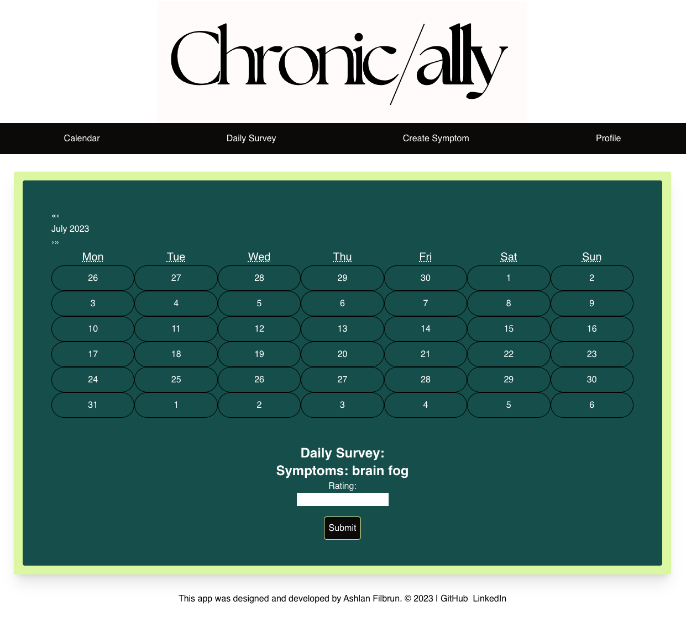

## Chronically

Chronic illness is tough and with everything going on it can be hard to isolate the cause of a recent flare up of symptoms. Why do I have more joint pain this week than normal? Why suddenly am I having more brain fog? Does my body not like that new vitamin? Is it because I started eating more red meat? Or maybe because I had a drink three days in a row? These and questions like these are often asked by people with chronic illness. Enter Chronically. Chronically is a web-based application that helps users with chronic illness track their symptoms day to day so they can easily pinpoint when symptoms started to increase in quantity and severity. By tracking symptom severity daily and knowing when symptoms started to increase, a user can take their chronic illness into their own hands and potentially isolate and eliminate potential triggers. 

This full-stack application was created by Ashlan Filbrun using the MERN stack and Tailwind.CSS.

# Check it out here: <a href=''>Chronically</a>

## Technologies Used
- <a href="https://www.figma.com/file/neUEC1MHPWGrLjGbDu3lUA/Capstone?type=design&node-id=1-2&mode=design&t=BnnstIrGcSoY36yz-0">Figma</a>
- <a href="https://trello.com/b/JjzzFnez/capstone">Trello</a>
- <a href="https://drive.google.com/file/d/1GqOy4f4zyFalv1zMB8jyjPR5BirPS7Qg/view?usp=sharing">ERD from copy.io</a>
- <a href="https://drive.google.com/file/d/1vizlZegN56fMt6UpfcvZgJ28B-BJm4FW/view">CHD from copy.io</a>
- <a href="https://www.canva.com/design/DAFp5Yktj7c/V0yuMxxvn71274M6sjm47A/edit">Logo from Canva</a>
- <a href="">Railway</a>

## Credits
- fonts from GoogleFonts
- <a href="https://tailwindcss.com/docs/installation">Tailwind</a>
- When implementing tailwindCSS I had to start a new repo so here's the <a href="https://github.com/ashfilbrun/capstone-frontend">original front-end repo</a>
- <a href="https://github.com/ashfilbrun/capstone-backend">Capstone Back-end</a>

## Future Additions 
- forum for users to ask each other questions and share advice/tips
- add scoring for symptoms that changes calendar day color in order to visually track your symptoms
- complete mobile functionality
- deploy back-end
- deploy front-end

## Connect with me!
- <a href='https://github.com/ashfilbrun'>GitHub</a>
- <a href='https://www.linkedin.com/in/ashlanfilbrun/'>LinkedIn</a>